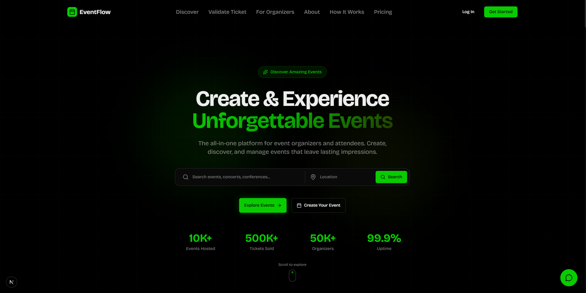

# EventFlow Frontend

### A modern, feature-rich event management platform built with Next.js 16, TypeScript, and Tailwind CSS. EventFlow provides a comprehensive solution for event organizers, attendees, and administrators with real-time updates, advanced analytics, and seamless payment processing.

## Demo Video

[Watch the project demo](https://drive.google.com/file/d/17msV-4BVTK-jHoDLgo2IMQPZNQo5n_Ey/view?usp=sharing)



## 🚀 Features

### For Attendees

- **Event Discovery**: Browse and search events with advanced filtering
- **Secure Checkout**: Stripe-integrated payment processing
- **Digital Tickets**: QR code-based tickets with calendar integration
- **Real-time Updates**: Live notifications for event changes
- **Profile Management**: Track bookings and payment history

### For Organizers

- **Event Creation**: Intuitive multi-step event creation wizard
- **Attendee Management**: Check-in system with QR scanning
- **Analytics Dashboard**: Detailed insights on sales and attendance
- **Seating Management**: Interactive seating chart configuration
- **Waitlist System**: Automated waitlist management
- **Payment Tracking**: Comprehensive revenue reports

### For Administrators

- **User Management**: Full user administration capabilities
- **Event Moderation**: Review and manage all platform events
- **Financial Reports**: Platform-wide revenue analytics
- **Audit Logs**: Complete activity tracking
- **System Analytics**: Platform usage statistics

### Technical Highlights

- **Real-time Updates**: WebSocket integration for live data
- **Responsive Design**: Mobile-first, fully responsive UI
- **Type Safety**: End-to-end TypeScript implementation
- **Form Validation**: Zod-based schema validation
- **Error Handling**: Comprehensive error boundaries and reporting
- **Optimistic Updates**: React Query for optimal UX
- **Dark Mode**: Full theme support

## 🛠️ Tech Stack

- **Framework**: Next.js 16 (App Router)
- **Language**: TypeScript
- **Styling**: Tailwind CSS
- **UI Components**: shadcn/ui + Radix UI
- **State Management**: React Query (TanStack Query)
- **Form Handling**: React Hook Form + Zod
- **Payment Processing**: Stripe
- **Real-time**: WebSocket API
- **Charts**: Recharts
- **Icons**: Lucide React
- **Calendar**: date-fns
- **Package Manager**: pnpm / npm / bun

## 📋 Prerequisites

- Node.js 18.x or higher
- npm, pnpm, or bun
- Git

## 🔧 Installation

1. **Clone the repository**

```bash
git clone https://github.com/rashedul-dev/eventflow-frontend.git
cd eventflow-frontend
```

2. **Install dependencies**

```bash
npm install
# or
pnpm install
# or
bun install
```

3. **Environment Setup**

Create a `.env.local` file in the root directory:

```env
# API Configuration
NEXT_PUBLIC_API_URL=http://localhost:5000/api
NEXT_PUBLIC_WS_URL=ws://localhost:5000

# Stripe Configuration
NEXT_PUBLIC_STRIPE_PUBLISHABLE_KEY=your_stripe_publishable_key

# App Configuration
NEXT_PUBLIC_APP_URL=http://localhost:3000
NEXT_PUBLIC_APP_NAME=EventFlow

# Optional: Analytics
NEXT_PUBLIC_GA_MEASUREMENT_ID=your_ga_id
```

4. **Run the development server**

```bash
npm run dev
# or
pnpm dev
# or
bun dev
```

5. **Open your browser**

Navigate to [http://localhost:3000](http://localhost:3000)

## 📁 Project Structure

```
eventflow-frontend/
├── app/                      # Next.js App Router pages
│   ├── (auth)/              # Authentication routes
│   ├── dashboard/           # Dashboard routes
│   │   ├── admin/          # Admin panel
│   │   ├── organizer/      # Organizer dashboard
│   │   └── attendee/       # Attendee dashboard
│   ├── events/             # Public event pages
│   └── checkout/           # Checkout flow
├── components/              # React components
│   ├── ui/                 # Base UI components
│   ├── auth/               # Authentication components
│   ├── dashboard/          # Dashboard components
│   ├── events/             # Event-related components
│   ├── analytics/          # Analytics components
│   ├── checkout/           # Checkout components
│   └── realtime/           # Real-time features
├── lib/                     # Utilities and configurations
│   ├── api/                # API client and hooks
│   ├── auth/               # Authentication context
│   ├── validations/        # Zod schemas
│   └── utils.ts            # Helper functions
├── hooks/                   # Custom React hooks
├── contexts/                # React contexts
├── public/                  # Static assets
└── styles/                  # Global styles
```

## 🎨 Key Components

### Authentication System

```typescript
// Protected route example
import { AuthGuard } from "@/components/auth/auth-guard";

export default function ProtectedPage() {
  return (
    <AuthGuard>
      <YourContent />
    </AuthGuard>
  );
}
```

### Real-time Updates

```typescript
// Using real-time hooks
import { useRealtimeEvent } from "@/hooks/use-realtime-event";

const { data, isConnected } = useRealtimeEvent(eventId);
```

### Form Validation

```typescript
// Using Zod schemas
import { eventSchema } from "@/lib/validations/event.validation";

const form = useForm({
  resolver: zodResolver(eventSchema),
});
```

## 🔑 Available Scripts

```bash
# Development
npm run dev          # Start development server

# Production
npm run build        # Build for production
npm run start        # Start production server

# Code Quality
npm run lint         # Run ESLint
npm run type-check   # Run TypeScript compiler check

# Formatting
npm run format       # Format code with Prettier
```

## 🌐 API Integration

The frontend communicates with the EventFlow backend API. Ensure the backend is running and accessible at the URL specified in `NEXT_PUBLIC_API_URL`.

### API Client Configuration

```typescript
// lib/api/client.ts
const apiClient = axios.create({
  baseURL: process.env.NEXT_PUBLIC_API_URL,
  headers: {
    "Content-Type": "application/json",
  },
});
```

## 🔒 Authentication Flow

1. User registers/logs in
2. JWT token stored in httpOnly cookie
3. Token automatically included in API requests
4. Auth context provides user state globally
5. Protected routes use AuthGuard component

## 📱 Responsive Design

EventFlow is fully responsive with breakpoints:

- Mobile: < 640px
- Tablet: 640px - 1024px
- Desktop: > 1024px

## 🎭 Theme System

Toggle between light and dark modes:

```typescript
import { useTheme } from "next-themes";

const { theme, setTheme } = useTheme();
```

## 🧪 Testing

```bash
# Run tests (configure as needed)
npm run test

# Run tests in watch mode
npm run test:watch

# Generate coverage report
npm run test:coverage
```

## 🤝 Contributing

1. Fork the repository
2. Create your feature branch (`git checkout -b feature/AmazingFeature`)
3. Commit your changes (`git commit -m 'feat: add amazing feature'`)
4. Push to the branch (`git push origin feature/AmazingFeature`)
5. Open a Pull Request

### Commit Convention

We follow [Conventional Commits](https://www.conventionalcommits.org/):

- `feat`: New feature
- `fix`: Bug fix
- `docs`: Documentation changes
- `style`: Code style changes (formatting)
- `refactor`: Code refactoring
- `test`: Adding tests
- `chore`: Maintenance tasks

## 📝 License

This project is licensed under the MIT License - see the [LICENSE](LICENSE) file for details.

## 👥 Authors

- **Rashedul Islam** - _Initial work_ - [GitHub](https://github.com/rashedul-dev)

## 🙏 Acknowledgments

- [Next.js](https://nextjs.org/) - React framework
- [shadcn/ui](https://ui.shadcn.com/) - UI components
- [Tailwind CSS](https://tailwindcss.com/) - CSS framework
- [Radix UI](https://www.radix-ui.com/) - Unstyled components
- [Stripe](https://stripe.com/) - Payment processing
- [React Query](https://tanstack.com/query) - Data fetching

## 📞 Support

For support, email rashedulislam.edge@gmail.com

## 🗺️ Roadmap

- [ ] Mobile app (React Native)
- [ ] Multi-language support
- [ ] Social media integration
- [ ] Advanced reporting tools
- [ ] Recurring events
- [ ] Event templates
- [ ] API webhooks

## 📊 Project Status

**Status**: Active Development 🚧

Latest version: 1.0.0

---

Made with ❤️ by the Rashedul
